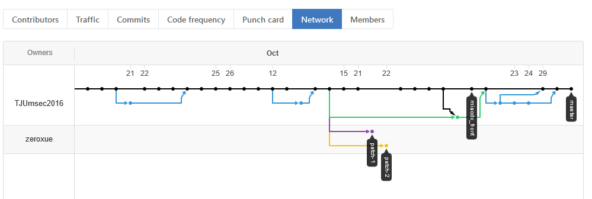
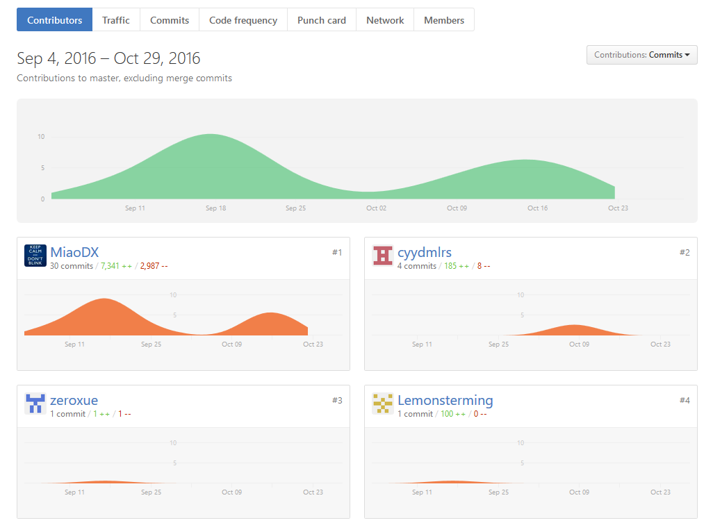
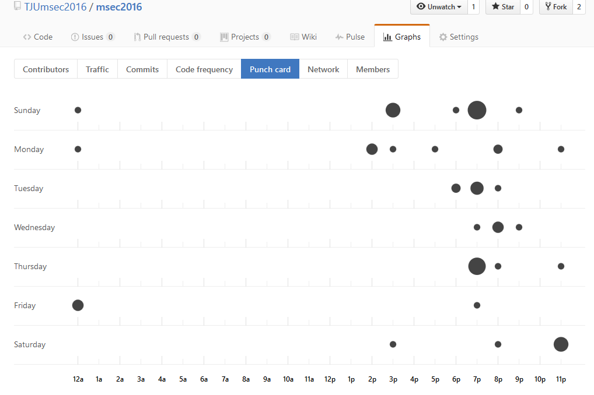

下面以图标形式给出一些 github 的使用统计结果。

1.首先是 `Network` 图表，它比较好的展示了我们小组的提交情况。

2.然后是 `Contributors` 图标，它在某一方面展示了大家的代码贡献量，但是项目不只是由代码组成的，更多的是大家一起的探讨，并且不少测试工作在图标上是不能很好地展示的。

3.最后是 `Punch card`，想来不少人对此图标不会很在意，不过这会给我们很多指导信息。可以看出，commit 总是在下午或晚上进行，这一般是因为我们总是在每天离开实验室时才进行 commit，但是发现有不少是 11p 甚至是 12a 进行的，这真的说明我们当天的睡觉时间是非常晚的。我们要爱护自己的身体啊！

就不再赘述其他的图表。